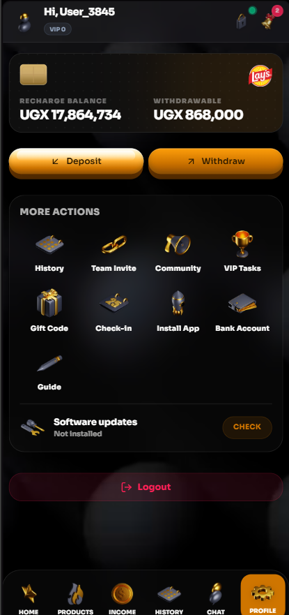
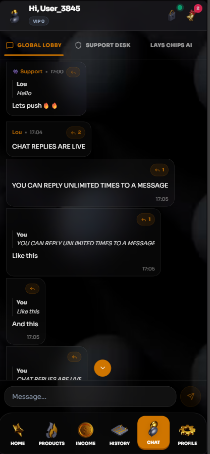
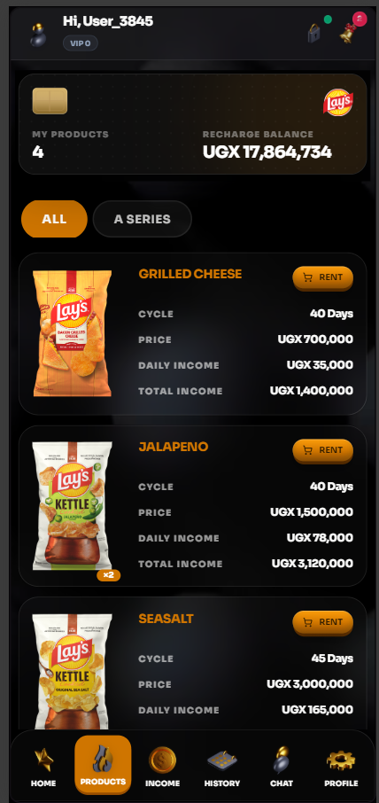

# Hut12

Built on Vite + React 19 + Express + Drizzle/MySQL.


## Quick Start
```bash
npm install
cp .env.example .env   # fill OPENROUTER_API_KEY, payment gateway, ADMIN_*
npm run dev            # http://localhost:3000
npm run build && npm run start  # production
```


## Admin
Set `ADMIN_PHONE/ADMIN_PASSWORD/ADMIN_USERNAME` in `.env`, then visit `/api/admin/access/activate` or `#/admin/access/activate`.

## Stack
React 19 · Vite 6 · Tailwind 4 · motion · three · @paper-design/shaders · Recharts · Express · Drizzle ORM · MySQL

---

## Overview
This platform allows users to sign up, rent products of any category, and earn daily passive income in UGX. Users can also invite friends, earn bonuses, complete VIP tasks, and withdraw their earnings. The application includes a comprehensive Admin Dashboard to manage users, transactions, the product catalog, and global configurations.

## Setup & Local Development
...see previous docs / .env.example for full SmarterASP & Render deploy guides.

## Screenshots




